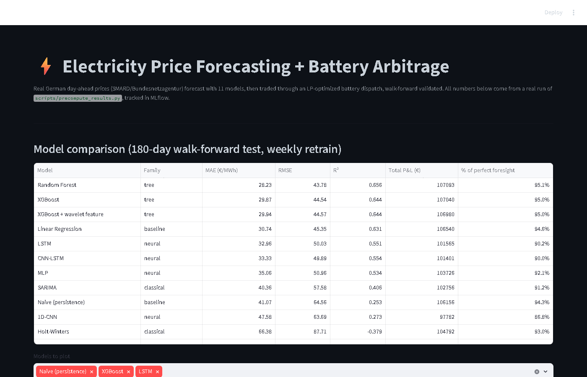
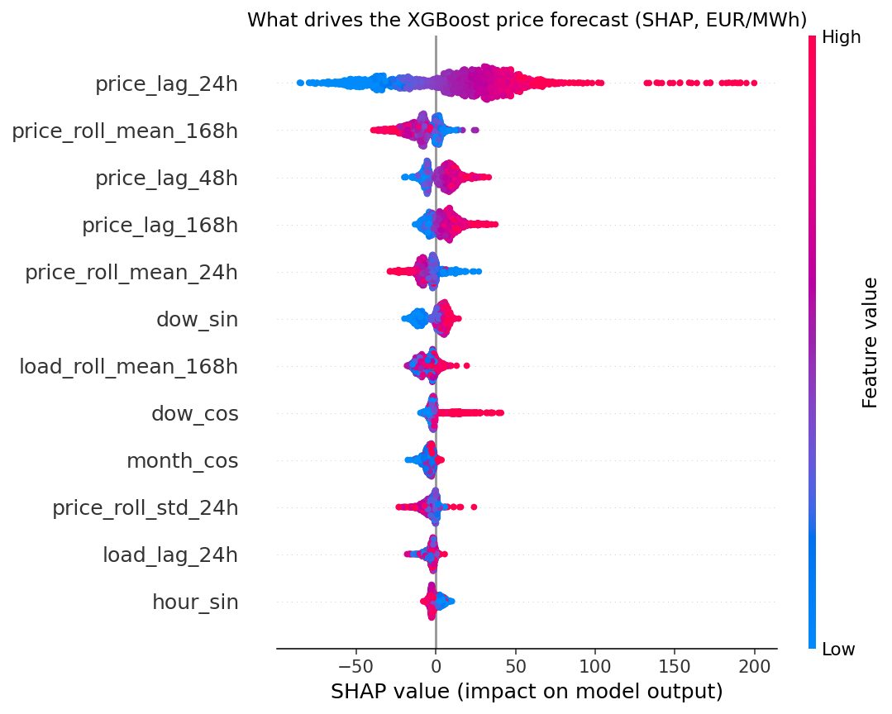

# GridArb: Electricity Price Forecasting + Battery Arbitrage

Real German day-ahead electricity prices, forecast with **11 models** (naive baseline, Holt-Winters, SARIMA, linear, Random Forest, XGBoost, MLP, 1D-CNN, LSTM, CNN-LSTM), then traded through a linear-programming battery dispatch. Walk-forward validated end to end, every run tracked in **MLflow**, the best model explained with **SHAP**. Nothing mocked.



```bash
pip install -r requirements.txt
pytest -q                                # 49 tests
python scripts/precompute_results.py     # ~3-year fetch, 11 models x 180-day walk-forward, backtest, MLflow, SHAP
streamlit run app.py                     # dashboard at localhost:8501
mlflow ui --backend-store-uri sqlite:///mlflow.db   # experiment tracking at localhost:5000
```

## Results

180-day walk-forward test (weekly retrain), DE-LU day-ahead prices up to Oct 2026, 4 MWh / 1 MW battery, 179 tradeable days:

| Model | Family | MAE (€/MWh) | R² | Total P&L | % of perfect-foresight ceiling |
|---|---|---|---|---|---|
| **Random Forest** | tree | **28.23** | **0.656** | **€107,093** | 95.1% |
| XGBoost | tree | 29.87 | 0.644 | €107,040 | 95.0% |
| XGBoost + wavelet feature | tree | 29.94 | 0.644 | €106,980 | 95.0% |
| Linear Regression | baseline | 30.74 | 0.631 | €106,540 | 94.6% |
| LSTM | neural | 32.96 | 0.551 | €101,565 | 90.2% |
| CNN-LSTM | neural | 33.33 | 0.554 | €101,401 | 90.0% |
| MLP | neural | 35.06 | 0.534 | €103,726 | 92.1% |
| SARIMA | classical | 40.36 | 0.406 | €102,756 | 91.2% |
| Naive (same hour, last week) | baseline | 41.07 | 0.253 | €106,156 | 94.3% |
| 1D-CNN | neural | 47.58 | 0.273 | €97,782 | 86.8% |
| Holt-Winters | classical | 66.38 | -0.379 | €104,792 | 93.0% |
| *Perfect foresight (ceiling)* | | | | *€112,628* | *100%* |

## What the results actually say

- **Tabular tree models win, deep nets do not.** Random Forest and XGBoost beat every neural network on error *and* on profit. Four neural architectures (MLP, CNN, LSTM, CNN-LSTM), all reading the same raw price window with the same no-leakage rule, land at R² 0.27 to 0.55. With ~25k hourly rows and strong lag structure, engineered lag features beat learned ones.
- **Better forecast does not mean better trading.** SARIMA, MLP, CNN, LSTM and CNN-LSTM all beat the naive baseline on R², yet all five made *less* money than it. The battery only needs the cheap vs. expensive hours ranked correctly within each day, not low average error.
- **The upside over a naive baseline is small.** The best model beats "same hour last week" by about €940 over 179 days (under 1% of P&L). Even the worst forecaster here (Holt-Winters, R² -0.38) still captures 93% of the ceiling, because a battery profits from the daily price shape alone. Forecast quality matters less for this strategy than it first appears.
- **A wavelet-denoised feature adds nothing.** An ablation of a causal wavelet feature against plain XGBoost: MAE 29.94 vs 29.87, P&L within €60. Reported as a null result; it stays in the repo because the ablation is the evidence.
- **SHAP:** yesterday's price at the same hour (`price_lag_24h`) drives the XGBoost forecast, about 3.5x the next feature (mean |SHAP| 34.0 vs 9.6 €/MWh).



## Engineering

- **Leak-free by construction:** every feature is built from data available at the day-ahead cutoff (t-24h and earlier), with tests that change future prices and assert features do not move. The wavelet feature denoises only a trailing window ending at t-24h.
- **One harness for all models** (`src/walk_forward.py`): tabular, sequence and classical models share the same retrain-and-predict loop. The four neural nets share one `SequenceModel` base, so windowing and scaling are identical.
- **Experiment tracking:** each model is an MLflow child run (params, MAE/RMSE/R², P&L, % of ceiling, runtime, predictions artifact) under one parent run.
- **Reproducible and fast:** seeded training, GPU if available (the LSTM walk-forward dropped from 30 min on CPU to ~70 s), CPU in CI, per-model result cache so an interrupted run resumes.
- **49 Python + 29 C++ tests + CI** (GitHub Actions): battery LP hand-calculated cases, feature causality, metrics, backtest logic, model shapes, SHAP additivity.

## Orchestration (Prefect)

`flows/gridarb_flow.py` runs the same pipeline as `scripts/precompute_results.py` as a **Prefect flow**: the SMARD data fetch is a task with retries and backoff,
every model is its own task with a timeout and one retry, one failing model is recorded in `failed_models` without discarding the others, and each run is
logged with its parameters and timings. `python flows/gridarb_flow.py` runs it once on a local ephemeral Prefect (no server, no account); `--serve` keeps it
running on a weekly cron; `prefect server start` gives the UI. Both entry points call the shared `src/pipeline.py`, and the flow's `results.json` is
identical to the script's (checked on the real cached run). 5 flow tests run in CI (a synthetic series; retry, failure isolation, parity with the plain
pipeline). Prefect needs a newer Starlette than some other projects pin, so it lives in `requirements-orchestration.txt` and the dashboard and tests of
everything else do not depend on it.

## Spread trading study and order-book simulator

Two extensions, each with its own tests (49 Python tests; the C++ suite has 29).

- **Cross-zone spread study** (`src/spread_trading.py`, `scripts/spread_study.py`, `docs/spread_study.md`): Engle-Granger cointegration screening, OLS hedge ratio, mean-reversion half-life, z-score entry/exit, a cost-aware backtest in EUR (prices go negative, so no percentage returns), and walk-forward validation (pair re-chosen on 180 days, traded on the next 30), run on real day-ahead prices of DE-LU and six neighbouring zones. It is a methodology study: market coupling makes every spread mean-reverting and no instrument lets you trade it, so the high paper Sharpe is not an edge. The report says so, and shows walk-forward against a look-ahead run and three cost levels with block-bootstrap intervals.
- **Intraday order-book simulator** (`intraday_lob/`, C++20, CMake, GoogleTest): a price-time-priority limit order book with integer tick prices, an inventory-aware market maker and a synthetic order-flow simulator (continuous intraday power trading is an order book), with 29 tests and latency benchmarks. It is generic and synthetic, not calibrated to EPEX data. CI builds and tests it on Linux.

## Two real bugs, caught by testing

1. **LSTM training bug:** full-batch gradient descent converged so poorly it scored R² = -0.26 and took 830 s for two retrain cycles. Mini-batch training fixed both.
2. **Battery "free energy" bug:** the backtest reset battery charge to a fixed value every day instead of carrying it over, letting the optimizer "discharge for free" each morning. Caught by a flat-price-day test expecting zero profit; the buggy version returned €47 of phantom profit.

## Known simplifications

- Day boundaries are UTC days, not the CET/CEST days the real auction runs on.
- Weekly retraining, not daily. Hyperparameters are sensible defaults, not tuned; the neural nets might close some of the gap with tuning, so "deep nets lose" is a result for these settings.
- SARIMA models the daily season only; Holt-Winters uses a weekly season and no regressors.
- One 180-day window on one market and one battery. This is not a claim about live trading returns.

## Stack

Python · pandas · scikit-learn · XGBoost · PyTorch · statsmodels · PyWavelets · SHAP · MLflow · SciPy (`linprog`) · Streamlit · Plotly · pytest · GitHub Actions. Data via [SMARD](https://www.smard.de) (Bundesnetzagentur).

Design decisions, data details and the full model list in [`docs/DETAILS.md`](docs/DETAILS.md).

## Test coverage

49 Python tests, **76% line coverage** of `src/` (CI fails below 65%), plus 29 C++ tests for the order-book simulator. The scripts under `scripts/` and the Streamlit app are not unit-tested.
